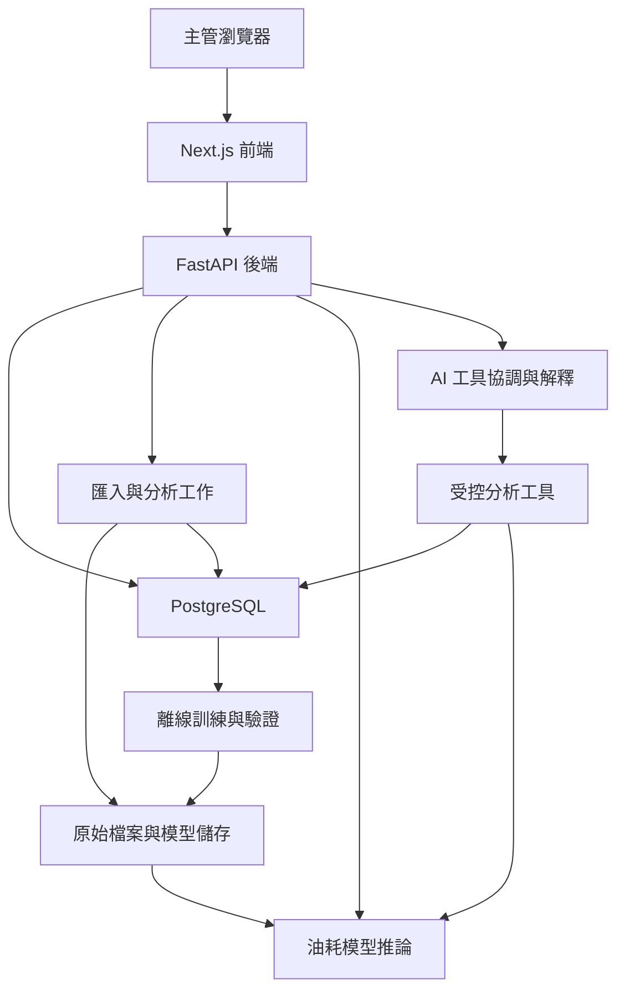

# FuelWise 網站架構 v0.1

## 1. 產品與使用者
目標：協助區域配送車隊主管找出值得調查的油耗問題、查看證據、建立改善任務與追蹤結果。駕駛提供作業情境，分析人員管理資料與模型。

第一版主流程：選擇車輛與行程 → 查看油耗分析 → 追查時間片段 → 向 AI 提問 → 補充作業情境 → 確認改善任務 → 追蹤變化。

目前提供本機開發骨架，尚未完成資料庫、匯入、訓練、AI、任務或部署。第一個模型為「行程結束後，依實際工況估計耗油」，不得標為出車前預測，也不能把模型殘差當成已證明可節省的油量。

## 2. 系統分工

| 模組 | 責任 | 不應負責 |
|---|---|---|
| Next.js＋TypeScript | 頁面、圖表、互動、狀態 | 自行重寫油耗算法或存放 API 金鑰 |
| FastAPI | 驗證、權限、查詢、分析、推論與對話 API | 每次點擊都重新訓練 |
| 純 Python 分析層 | 不規則取樣、事件配對、品質與特徵 | 假定每筆間隔相同 |
| PostgreSQL | 車隊、車輛、行程、分析、預測、任務 | 暴露給瀏覽器直接連線 |
| 私有檔案儲存 | 原始檔、模型、匯出報告 | 公開原始車聯網資料 |
| 離線模型流程 | 時間切分、基準、訓練、評估、保存 | 將未來資料帶入訓練 |
| 語言模型 | 理解提問、使用工具、解釋與任務草稿 | 憑空產生數字或自行修改任務 |

起步用單一後端、清楚分層；先不拆多個微服務。大檔匯入與批次分析在背景工作執行，API 回 job_id 供查進度。

## 3. 頁面与路由

| 路由 | 頁面 | 核心內容 | 階段 |
|---|---|---|---|
| / | 車隊總覽 | 日期、總油量、總里程、加權油耗、覆蓋率、待檢查行程 | 多趟；骨架目前顯示單趟摘要 |
| /vehicles | 車輛列表 | 搜尋車輛、最近資料、可分析行程數 | 多趟 |
| /vehicles/[vehicleId] | 單車歷史 | 油耗趨勢、行程列表、比較基準 | 多趟 |
| /trips/[tripId] | 行程診斷 | 指標、時間軸、事件、資料品質、AI 側欄 | 第一個正式工作頁 |
| /data | 資料匯入 | 上傳、欄位映射、時區、進度、拒收原因 | 多趟 |
| /actions | 改善任務 | 草稿、執行中、追蹤中、已結束、未採用 | 改善追蹤 |
| /actions/[actionId] | 任務成效 | 假設、行動、比較行程、前後變化與限制 | 改善追蹤 |
| /models | 模型評估 | 版本、適用範圍、測試日期、MAE、基準比較 | 模型，分析人員使用 |

桌面左側導覽，中央工作區，行程頁右側 AI 側欄。手機收合導覽與側欄。AI 跟隨目前車輛與行程，第一版不另做獨立聊天首頁。

### 行程診斷頁
1. 車輛、行程、起訖時間與明確時區。
2. 距離、時間、端點耗油、L/100km、停車引擎運轉估計。
3. 模型卡：not_ready、ready、out_of_scope、insufficient_data；未知不能回 0 L。
4. 共用時間軸：GPS/CAN 車速、RPM、水溫、階梯狀累積燃油；不同單位分圖，稀疏區間標示。
5. 事件：平台事件與自行計算的候選片段分開。
6. 證據：原始列、時間片段、計算方法與版本。
7. AI：提問、引用證據、補充情境、改善任務草稿。

全站涵蓋 loading、empty、partial、ready、error。沒有資料就呈現空狀態，不用虛构車隊數字填滿。

## 4. 資料庫設計

| 表 | 關聯／主要欄位 |
|---|---|
| fleets | id、name |
| memberships | user_id、fleet_id、role（manager/analyst/driver） |
| vehicles | id、fleet_id、enabled_code、plate、已知車型 |
| imports | id、fleet_id、file_hash、storage_key、source_timezone、status、error_summary |
| trips | id、vehicle_id、import_id、journey_code、start_at、end_at、quality_status |
| telemetry | id、trip_id、import_id、source_row、timestamp、GPS、CAN、RPM、水溫、累積計數器、raw_payload |
| event_notices | id、trip_id、source_row、slot、type、start_at、end_at、原始事件內容 |
| events | id、trip_id、type、start_at、end_at、duration、completeness、配對版本 |
| trip_features | trip_id＋feature_version、distance_km、duration_s、fuel_used_l、工況特徵、品質旗標 |
| analyses | id、trip_id、analysis_version、feature_version、metrics、limitations、created_at |
| evidence_items | id、analysis_id、來源列、時間片段、方法、事實／估算類型 |
| models | id、task、artifact_key、特徵版本、資料版本、訓練期間、切分、評估、套件版本、status |
| predictions | id、trip_id、model_id、predicted_fuel_l、residual_l、適用性、created_at |
| conversations/messages | id、fleet_id、trip_id、role、content、引用證據、工具記錄 |
| context_feedback | id、trip_id、user_id、片段、情境、填報時間 |
| actions | id、fleet_id、trip_id、title、hypothesis、owner、status、metrics、期間、確認時間 |
| action_evaluations | id、action_id、比較行程、匹配規則、結果、限制、版本 |

### 儲存與品質規則
- 外部設備 ID 與行程代碼以文字保存，內部另有主鍵；journeyCode 不假定跨車隊唯一。
- 先確認來源時區，再轉 UTC 儲存。原始檔不帶時區時不得偷偷假定。
- 清洗結果與原始資料分開，任何指標都可追溯檔案與列。
- 重複上傳用檔案 hash 與来源列處理；跨檔重疊用來源識別或記錄指紋，衝突保留查核。
- 同時間可能有不同事件，不能單靠 timestamp 刪重。
- 展開三個 event slot 再配對；優先正式事件 ID，否則設備＋事件類型＋開始時間為暫定鍵。
- 保留平台 duration 與 end-start 兩種值；不一致時標記。
- 累積計數器下降須處理重置；差分為零不等於實際耗油為零。
- 原始缺失、無事件、不適用、數值 0 是不同狀態，不全部補 0。
- 車隊油耗 = 100 × 同一有效行程集合的總油量 / 總里程，不直接平均每趟 L/100km。揭露有效行程覆蓋率。

## 5. API 合約

| API | 功能 | 目前狀態 |
|---|---|---|
| GET /health | 健康檢查 | 已提供 |
| GET /api/v1/demo/trip | 已分析行程固定摘要，非即時重算 | 已提供 |
| POST /api/v1/analyses/preview | 正規化取樣的即時計算，最多20000筆，不儲存 | 已提供 |
| GET /api/v1/models/status | 是否有模型可用 | 已提供，not_ready |
| POST /api/v1/imports | 建立匯入工作，202＋job_id | 規劃 |
| GET /api/v1/jobs/{id} | 進度與錯誤 | 規劃 |
| GET /api/v1/vehicles | 車輛列表、分頁 | 規劃 |
| GET /api/v1/trips | 車輛與日期篩選、分頁 | 規劃 |
| GET /api/v1/trips/{id}/analysis | 指標、品質與版本 | 規劃 |
| GET /api/v1/trips/{id}/series | 指定訊號與區間 | 規劃 |
| GET /api/v1/trips/{id}/events | 配對事件及候選片段 | 規劃 |
| POST /api/v1/trips/{id}/predictions | 同特徵與模型版本的推論 | 規劃 |
| POST /api/v1/conversations/{id}/messages | 問答，後續可加 SSE | 規劃 |
| POST /api/v1/trips/{id}/feedback | 作業情境回饋 | 規劃 |
| POST /api/v1/actions | 確認後建立任務 | 規劃 |
| PATCH /api/v1/actions/{id} | 更新任務與狀態 | 規劃 |
| GET /api/v1/actions/{id}/evaluation | 成效比較 | 規劃 |

正式錯誤回傳 code、message、request_id、可選欄位錯誤。輸入錯誤422，未登入401，無權限403，資源不存在404；避免洩露他人資源資訊。大檔與長任務走202＋進度查詢。

正式分析回傳包含 value、unit、observed/derived/estimated、method、evidence_ids、limitations。圖表可降採樣，但指標用原始資料計算。

## 6. 模型流程與契約

原始取樣 → 品質檢查 → 每趟一列特徵 → 日期切分 → 基準模型 → 候選模型 → 測試 → 保存 Pipeline 與 manifest → 人員啟用 → API 推論。

先單車多趟；後續多車需處理車型與工況差異。沒有載重就標示缺失，不以 engineLoad 代替。

目標 fuel_used_l。禁止用本趟 L/100km、燃油費、燃油計數器起訖值做輸入。模型擬合與前處理只使用訓練集；測試日期較晚，同趟不跨資料集。

基準：訓練資料總油量／總里程 × 該趟里程。評估 MAE(L) 並檢查不同行程長度與工況。未經校準不提供貌似精確的預測區間。

manifest：model_id、task、feature_version、feature_schema、target_unit、dataset_version、training_date_range、split_definition、test_metrics、baseline_metrics、package_versions、artifact_hash、applicability。

部署只載入受信任模型，固定套件版本，啟動檢查特徵版本；版本不符停止推論。訓練與部署共用特徵函式，避免同名特徵算法不同。

模型可用時回 predicted_fuel_l 與 model_id。residual = observed − predicted，只表示偏離；不自動判為浪費。沒有模型回 not_ready，不能填示範預測。

## 7. 生成式 AI 與行動

後端提供 get_trip_analysis、get_trip_evidence、get_comparable_trips、get_model_prediction、draft_improvement_action 五類工具。每次工具呼叫都做車隊授權與參數驗證。

模型不得任意執行 SQL、程式或直接變更任務。使用者與檔案文字屬資料，不可覆寫系統規則。數字來自工具，回答附 evidence_id；資料不足時清楚回覆。

回答結構：觀測 → 可能解釋 → 限制 → 下一步。使用者可填報等候卸貨等情境，保留填報人與時間，不把填報當成感測真值。

任務先產生草稿，使用者確認後保存。成效頁顯示比較行程與其他條件變化；觀察性比較不能直接宣稱因果節油。

## 8. 程式責任與目錄

| 路徑 | 責任／狀態 |
|---|---|
| frontend/app | 已有首頁、layout、樣式；其他路由後續加入 |
| frontend/components | 後續加入指標、圖表、品質與 AI 元件 |
| frontend/lib | 後續 API client、型別、錯誤處理 |
| backend/app/main.py | 已有 API 入口，之後拆 routers |
| backend/app/services/analysis.py | 已有獨立數值分析核心 |
| backend/app/services | 後續 events、features、prediction、assistant |
| backend/app/repositories | 後續資料存取與授權範圍 |
| backend/app/workers | 後續匯入與背景工作 |
| backend/tests | 已有非等間隔加權與計數器重置檢查 |
| ml | 已有模型規劃；尚無 train.py 或模型檔 |
| docs | 架構文件 |

## 9. 部署設計

本機：Next.js localhost:3000、FastAPI localhost:8000。骨架後端綁127.0.0.1，無帳號功能，僅供本機開發。

正式：前端託管環境＋Python服務＋PostgreSQL＋私有物件儲存。採同網域 /api 反向代理，或指定API網域與精確CORS。API金鑰只放後端環境變數。

順序：資料庫遷移 → 後端環境變數與服務 → 健康檢查 → 前端連線設定 → HTTPS → 登入與授權 → 匯入、分析、對話完整操作。模型可以先not_ready，不影響描述性分析。

公開部署前完成：登入、每筆資料車隊授權、上傳型別與大小限制、原始檔私有、資料庫備份、長任務去重重試、request_id、模型與分析版本紀錄。日誌不得保存密鑰與完整敏感資料。

## 10. 開發順序與驗收

| 階段 | 成果 | 驗收 |
|---|---|---|
| 0 架構骨架 | 本機單趟摘要＋分析API | 區分固定摘要、即時計算與未提供功能 |
| 1 單趟工作頁 | 匯入選定行程與時間軸 | 重算1750s、12.4km、2.5L、313s，配對14個超速事件 |
| 2 多趟資料 | 匯入、單車歷史、品質 | 重複匯入不重複計數、可追溯來源 |
| 3 模型 | 訓練、基準、評估、推論 | 日期切分不洩漏、適用性與版本可查 |
| 4 AI與行動 | 引用證據的問答、情境、任務 | 無資料不捏造、使用者確認任務 |
| 5 上線 | 完整網站與部署 | 登入、權限、匯入、分析、問答與任務可操作 |

目前沒有訓練完成的模型、公開網址或已證實節油量。
